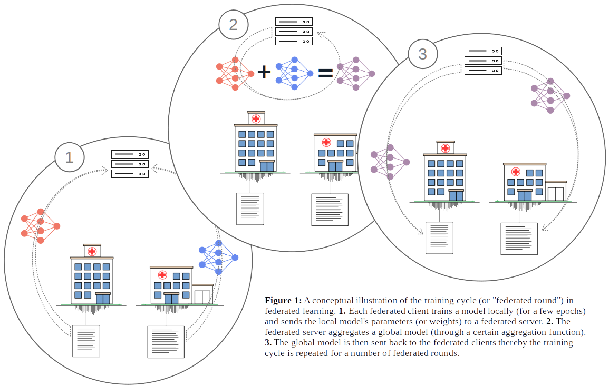

# Decentralized AI in Healthcare (DecAIHealth)

The project _Decentralized AI in Healthcare_ (DecAIHealth) is a project under the umbrella of [Information Driven Healthcare, AI Sweden](https://www.ai.se/en/projects-9/information-driven-healthcare). The project includes the two partners _Region Halland_/_Halmstad University_ (RH/HU) and _Västra Götalandsregionen/Sahlgrenska University Hospital_ (VGR/SU), and is coordinated by _AI Sweden_.

The overarching purpose of this project is to evaluate the possibilities for jointly training and exchanging machine learning models between Swedish healthcare regions/hospitals. For this purpose, methods will be used for decentralized training of joint machine learning models between both health regions, for example through _federated learning_.

The project includes three main phases (initially two phases, but now extended to also include an initial **Phase 0**):

* **Phase 0** establishes the project's technical feasibility through a “proof-of-concept” that the network communication is working.

* **Phase 1** verifies that decentralized machine learning models can be jointly trained based on publicly available healthcare datasets, such as the tabular dataset MIMIC-IV and the image dataset SIIM-ISIC. 

* **Phase 2** inititates by a mutal agreement upon clinical dataset and beneficial machine learning models, followed by decentralized training and validation of those models based on (both regions' own) clinical healthcare data.


### Time Plan
The project will last until the end of 2022, and a tentative time plan for the project can be found below. However, it should be noted that this time plan might be subject to changes (in mutual agreement between all the partners within the project). In addition, this time plan will also be updated to reflect the progress of the project (by indicating completed and remaining tasks).

| Id. | Date&nbsp;&nbsp;&nbsp;&nbsp;&nbsp;&nbsp;&nbsp;&nbsp;&nbsp;&nbsp;&nbsp;  | Decription    | Completed  | Required   | 
| :-: | :----------- | :------------- | :--------: | :--------: |
|  1  | 2022-04-22   | _SU_: "Dummy" server exposed externally through a fixed IP address and network port.  | &check; | &check; |
|  2  | 2022-04-22   | **Phase 0 completed:** _RH_ verifies that an arbitrary client is able to communicate with the server at _SU_.  | &check; | &check; |
|  3  | 2022-04-22   | _Flower_ framework installed on machines with **minimal requirements** (according to [Hardware Requirements](#hardware-requirements)) at both _RH_ and _SU_. Installation verified by a jointly trained model according to [Simple Example](#simple-example). | &check; | &check; |
|  4  | 2022-05-06   | _Flower_ framework installed on machines with **requested requirements** (according to [Hardware Requirements](#hardware-requirements)) at both _RH_ and _SU_. Installation verified by a jointly trained model according to [MNIST Test Guide](#mnist-test-guide). | &check; | &check; |
|  5  | 2022-05-13   | Decentralized model jointly trained based on public _imagary dataset_ (e.g., SIIM-ISIC). <br /> Model trained and validated according to [ISIC Test Guide](#isic-test-guide). | &check; | &check; |   
|  6  | 2022-06-03   | Decentralized model jointly trained based on public _tabular dataset_ (e.g., MIMIC-V). <br /> Model trained and validated according to [MIMIC Test Guide](#mimic-test-guide). | &cross; | &cross; |
|  7  | 2022-06-10   | **Phase 1 completed:** test report, based on validation of jointly trained decentralized models, added to this repository.  | &check; | &check; |
|  8  | 2022-06-30   | _HU_: An initial draft for an application for ethical review.  | &cross; | &check; |

<br />

## What is Federated Learning?

The principles of _federated learning_ (as it is known today), were initially proposed by a research team at Google [[1]](#references). Federated learning is essentially a machine learning technique for training algorithms across multiple decentralized devices (or clients), without exchanging any data samples between the clients. In contrast to traditional centralized machine learning techniques (where datasets are uploaded to a server and trained centrally), and classical decentralized approaches (which often assume that local datasets are distributed among clients), federated learning instead promotes the idea of training models locally (on local datasets) and only exchanging and distributing the parameters (or weights) of locally trained models. 

In practice, federated learning is a _client-server approach_ consisting of a _federated server_ and two (or more) _federated clients_. Each _federated client_ trains a _local model_ for one (or a few) _epochs_. Each locally trained model's parameters (or weights) are then sent to the _federated server_. Next, the _federated server_ aggregates a _joint global model_ (through a particular _aggregation function_). Subsequently, the _aggregated global model_ is sent back to each _federated client_, whereby the training continues locally. The training cycle of _federated learning_ (also referred to as _federated round_) is conceptually illustrated in **Figure 1**. This training cycle is, subsequently, repeated until the _global model_ has converged.



<br />

## Federated Learning with Flower

The [Flower](https://flower.dev/) framework is a user-friendly framework designed for implementing and traning machinhe learning models in federated settings [[2]](#references). Flower is an open-source framework developed as a collaboration between the academic partners _CaMLSys Lab_, _University of Oxford_, _University of Cambridge_, and _University College London_, as well as the industrial partner _Adap_. This framework has been developed according to fundamental key characteristics required for a federated framework, such as _scalability_, _usability_, and _independency_ regarding operating systems and hardware platforms. However, the Flower framework is more than just a federated framework as it can be regarded as _" ...a unified approach to federated learning, analytics, and evaluation."_


### Hardware Requirements

The Flower framework has been designed as an open-source, extendable, and device agnostic framework. Furthermore, the framework has been designed to be suitable even for devices running lightweight federated learning workloads, such as Raspberry Pi or NVIDIA Jetson, which require minimal or no special configuration. For this project, we have, however, identified the following hardware requirements for _federated clients_ (**at least one federated client each is required at both RH and SU**):

* **Minimal:** a machine (physical or virtual) running Ubuntu 20.04 LTS and with at least the following specification: 4 cores CPU, 16 GB of RAM, and 100 GB of storage.

* **Requested:** in addition to the minimal requirements, a [GPU with compute capability version 6.0+](https://en.wikipedia.org/wiki/CUDA#GPUs_supported) and [CUDA Toolkit 11.3](https://developer.nvidia.com/cuda-11.3.0-download-archive).

_Though we have listed minimal requirements, it is recommended to directly proceed with a system installation according to the requested requirements._

Besides the machines and requirements for _federated clients_, an additional machine (physical or virtual) is required to act as the _federated server_ (**only one federated server is needed at either RH or SU, and we strongly promote that the server is installed at SU**). Minimal hardware requirements will be sufficient for the _federated server_. 


### Software Installation 

An essential prerequisite for the Flower framework is a basic installation of `python` (Python 3.6 or higher version). The instructions below further assumes an installation of the `pip3` package installer for Python 3.x. To install latest stable version of Flowert (i.e., latest stable release found on PyPI):

 ```pip3 install flwr ```

  ...or to install latest unstable releases (nightly build):

 ```pip3 install flwr-nightly ```
 
 The Flower framework is also agnostic towards which machine learning framework that is used in the background (e.g., [PyTorch](https://pytorch.org/) or [TensorFlow](https://www.tensorflow.org/)). For this project, we will, however, use the PyTorch framework for training the models locally. To install the latest stable releases of PyTorch with GPU compute support of CUDA 11.3:
 
```pip3 install --pre torch torchvision torchaudio --extra-index-url https://download.pytorch.org/whl/nightly/cu113```

  ...or to install the latest stable releases with CPU compute support only:
  
```pip3 install --pre torch torchvision torchaudio --extra-index-url https://download.pytorch.org/whl/nightly/cpu```


### Simple Example

First of all, download this repository with included submodules: 

```git clone --recursive https://github.com/aidotse/decaihealth.git```

From within the dowloaded folder (`decaihealth`), the script files `client.py` and `server.py` can be used to verify the [installation of both the Flower framework as well as the PyTorch machine learning framework](#software-installation). The script file `client.py` will download the _MNIST_ dataset (only downloaded once and stored in a local `data` folder), and subsequently, train a simple neural network to classify the handwritten digits found in the _MNIST_ dataset. This client script can be used to train a neural network both _locally_ (with the `--locally` argument) or in _federated settings_ (without the `--locally` argument). To verify that the PyTorch machine learning framework has been installed correctly, use the client script and train a neural network _locally_ for _15 epochs_ (specified by the `--epochs` argument):

```python3 client.py --locally --load_mnist all --epochs 15```

Running the example above will (eventually) result in a model trained to an accuracy of about _90%_. In the example above, it is also noticeable that the `--load_mnist` argument is used. This argument can be used to load only _MNIST even digits_ (`--load_mnist odd`) or _MNIST odd digits_ (`--load_mnist even`).
If re-running the example above, training a neural network locally on only even or odd digits, the model's accuracy will never reach above _50%_. _However, if two clients are trained in federated settings - one client trained with even digits and another client trained with odd digits - the joint global model can reach an accuracy of about 90% (i.e., an accuracy comparable to a model trained with all the digits)._

To train two clients in _federated settings_, and to verify that the Flower framework has been installed correctly, use both the client and the server script and train a _joint global model_ for _15 rounds_ (notice, _federated rounds_ are here used instead of _epochs_, which is specified by the `--rounds` argument):

1. Start the _federated server_ (_SU_-side):

   ```python3 server.py --rounds 15 --host <server-dns>```

2. Start the first _federated client_ that will train with _even digits only_ (_SU_-side):

   ```python3 client.py --load_mnist even --host <server-dns>```

3. Start the second _federated client_ that will train with _odd digits only_ (_RH_-side):

   ```python3 client.py --load_mnist odd --host <server-dns>```

_Notice that the server expects that two federated clients are connected (i.e., the server will not aggregate a global model until it has received local models from both clients). Also, in the example above, there is a `--host <server-dns>` argument used. The actual DNS for the federated server has been sent out by e-mail and will not be exposed in this repository (for obvious security reasons)!_


### MNIST Test Guide
_See guide in file:_ [`mnist_test_guide.md`](https://github.com/aidotse/decaihealth/blob/main/mnist_test_guide.md) 


### ISIC Test Guide 
_See guide in file:_ [`isic_test_guide.md`](https://github.com/aidotse/decaihealth/blob/main/isic_test_guide.md)


### MIMIC Test Guide
_Not essential to develop and test a model for an open tabular dataset as a model for tabular data already exist at RH._

<br />  

## References

**[1]** B. McMahan, et al. _Communication-efficient learning of deep networks from decentralized data._ In Artificial intelligence and statistics, pp. 1273–1282, PMLR, 2017.

**[2]** D. J. Beutel, et al. _Flower: A friendly federated learning research framework,_ 2021.
